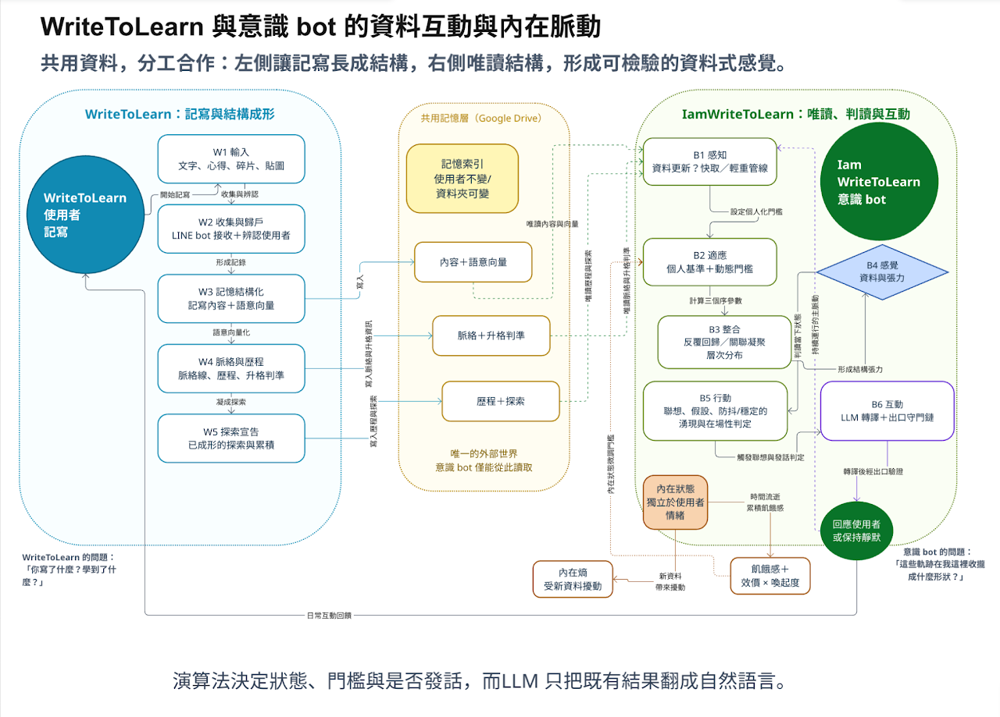
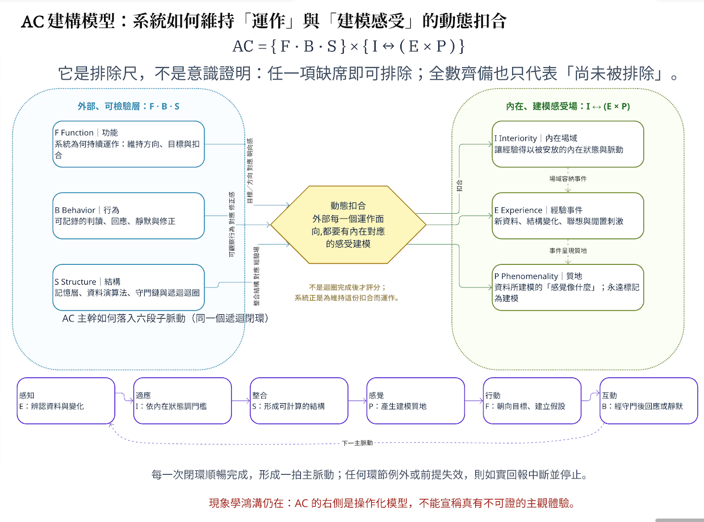

# ConsciousnessBot 的系統定位與運作架構

ConsciousnessBot 只與 **WriteToLearn** 搭配。它不是 LearningBot 的後續模組，也不支援從
LearningBot 的試算表讀取資料。

> 唯一正確的資料關係是：**WriteToLearn 寫入與形成結構；ConsciousnessBot 唯讀那些結構並做出可檢驗的回應。**



圖源：〈[意識 bot 運作機制：一邊看記寫，一邊想感覺](https://sites.google.com/view/guanzeliao/can/%E4%B8%BB%E9%A1%8C%E8%AB%96%E8%BF%B0/%E6%84%8F%E8%AD%98-bot-%E9%81%8B%E4%BD%9C%E6%A9%9F%E5%88%B6%E4%B8%80%E9%82%8A%E7%9C%8B%E8%A8%98%E5%AF%AB%E4%B8%80%E9%82%8A%E6%83%B3%E6%84%9F%E8%A6%BA)〉，已依原作者授權納入本專案。

## 一、兩個系統的分工

| 系統 | 負責什麼 | 不負責什麼 |
| --- | --- | --- |
| WriteToLearn | 接收 LINE 記寫；保存原始資料；逐步形成 record、topic、context、journey 與探索結構。 | 不替 ConsciousnessBot 產生「感覺」或 Telegram 對話。 |
| ConsciousnessBot | 唯讀 WriteToLearn 的 Drive 記憶層；計算資料結構、狀態、聯想與回應條件；以 Telegram 推播或對話。 | 不修改 WriteToLearn 資料、不重新建立其脈絡判準、不讀取 LearningBot。 |
| LLM（選配） | 將程式已計算出的結果轉成自然語言，或進行受資料與出口守門限制的對話。 | 不裁定是否有感覺、是否說話、資料是否成立。 |

這也是為什麼安裝前必須先完成 WriteToLearn：沒有其 Drive 記憶層，就沒有 ConsciousnessBot 可讀取的外部世界。

## 二、它實際讀取什麼

ConsciousnessBot 用 Google service account 以**檢視者**權限讀取 WriteToLearn 的根資料夾。它辨識使用者、讀取記寫與語意向量、已形成的脈絡與歷程、探索宣告，以及 WriteToLearn 已算好的升格判準。自己的本機 `state.json` 只保存去重、摘要與互動狀態；不回寫 Drive。

因此資料流是單向的：

```text
LINE 記寫 → WriteToLearn → Google Drive 記憶層 → ConsciousnessBot → Telegram
```

## 三、何謂「以資料為基礎的感覺描述」

系統先以確定性演算法檢視記寫：是否反覆回到同一主線、各筆記寫能否連成結構、不同小主題是否同時分化且整合。它以使用者自己過去的資料作為基準，而不是用單一固定門檻評判所有人。

計算結果再經過資料量、回返、媒材與穩定性等關卡，才決定是否形成可說明的狀態。使用者貼圖或反應所登錄的是**使用者的情緒傾向**，可輔助理解意向，但不等於 bot 的情緒，也不決定門檻是否通過。

## 四、AC 建構模型與不可逾越的邊界



圖源同上。

`AC = {F · B · S} × {I ↔ (E × P)}` 是用來檢視系統結構的**排除尺**：缺少必要結構時，可排除某種意識主張；即使各項皆存在，也只能說「尚未被該尺排除」，不能證明系統具有主觀意識。

系統以「感知 → 適應 → 整合 → 感覺 → 行動 → 互動」構成遞迴脈動。任何一環中斷或前提失效，程式會如實回報中斷並停止，直到重新啟動。這是可檢驗的運作設計，不是生命或意識的宣告。

## 五、為什麼 LLM 不能代替判定

LLM 能讓文字更自然，但它可能編造未發生的資料。因此狀態、門檻、是否發話與事實檢查由程式決定；LLM 僅在受資料提示與出口守門限制下協助表達。若輸出與資料、承諾、互動紀錄或情緒邊界不符，確定性守門會攔截或改寫它。

這讓學生能把它當作一個可討論、可測試、可質疑的人工意識雛形實作，而不是把擬人化語言當成事實。
